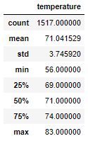

# Surfs Up!
## Overview:
The purpose of this analysis is to help W. Avy determine if weather would permit an ice cream surf shop to be viable year-round in Oahu, Hawaii. W. Avy wanted to take a closer look at temperatures during the months of June and December, to get a better idea what the extreme months would look like for the ice cream surf shop.

## Results:
  - Average Temperatures:
     - June: 74.9°F
     - December: 71.0°F
  - Standard Deviation:
     - June: 3.26
     - December: 3.75
  - Count:
     - June: 1700
     - December: 1517  

June:                December:  
 

## Summary:
Upon closer inspection, there is not much variance between June and December seasons. The average temperature in June is 74.9°F, whereas the average temperature in December is 71.0°F. I did notice that the range of temperatures is wider for the month of December (56°F-83°F) vs June (64°F-85°F). While max temperature in June is only 2°F warmer, the minimum in December is 8°F cooler. December has a higher standard deviation, so the weather may be less predictable. I would imagine the few colder days that you may see in December might have an impact on sales, but with the averages being so close; I don't think that the number of cool December days will have a large impact on overall annual sales. I would be interested to complete the same analysis on the precipitation for June and December. I think that the precipitation has a *lot* to do with the stable temperatures year-round, and would be curious to see if there are spikes during the summer or lulls during the winter that could affect minimum temperature ranges. Furthermore, there are 183 less samples for the December data. I would be interested why there is less data for the month of December. Whatever the reason for the discrepency could be a cause of an unknown variance.
